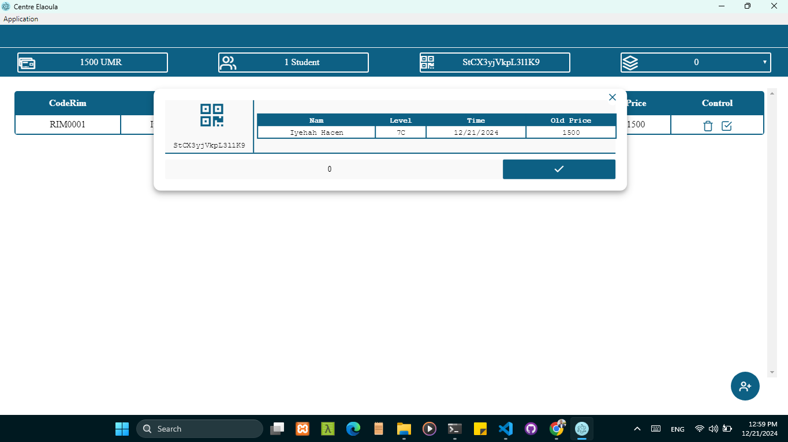

# School Management App

This is a **School Management App** built using **Electron.js**. It allows users to manage student data, calculate total prices, and update individual student prices efficiently. Below is a detailed overview of the application's features and functionalities.

## Features

1. **Add Students**
   - Easily add new students to the system using a form.
   - Short command to open the Add Student form: `Ctrl + Shift`.
   - Interface example: 
   

2. **Calculate Total Price**
   - Automatically calculate the total price of all students.

3. **Update Student Price**
   - Modify the price for individual students.
   - Short command to open the Update Price form: `Ctrl + E`.
   - Interface example: 
   

4. **Search for Students**
   - Quickly search for specific students.
   - Short command for search functionality: `Ctrl + F`.

5. **Reset Application State**
   - Hide all open forms (Add, Edit, Search) and return to the initial state of the app.
   - Short command to reset: `Ctrl + Alt`.
   - Initial interface example:
   

## Getting Started

### Installation
1. Clone this repository:
   ```bash
   git clone <repository-url>
   ```
2. Navigate to the project directory:
   ```bash
   cd school-management-app
   ```
3. Install dependencies:
   ```bash
   npm install
   ```
4. Start the application:
   ```bash
   npm start
   ```

### Usage
- Use the short commands mentioned above to interact with different parts of the application efficiently.
- Ensure all required data is entered correctly to avoid issues.

## Screenshots
- **Initial Interface**: 
- **Add Student Form**: 
- **Update Price Form**: 

## Contributing
If you'd like to contribute to this project, feel free to fork the repository and submit a pull request.

## License
This project is licensed under the [MIT License](LICENSE).

## Contact
For any questions or issues, feel free to reach out to the project maintainer.
